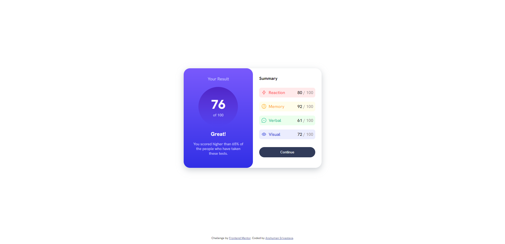
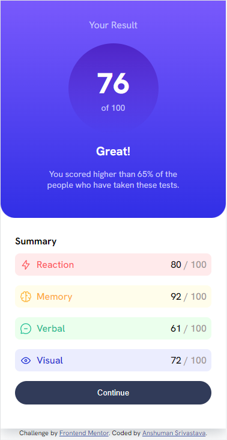

# Frontend Mentor - Results summary component solution

This is a solution to the [Results summary component challenge on Frontend Mentor](https://www.frontendmentor.io/challenges/results-summary-component-CE_K6s0maV). Frontend Mentor challenges help you improve your coding skills by building realistic projects.

## Table of contents

- [The challenge](#the-challenge)
- [Screenshot](#screenshot)
- [Links](#links)
- [Built with](#built-with)
- [Useful resources](#useful-resources)
- [Author](#author)

### The challenge

Users should be able to:

- View the optimal layout for the interface depending on their device's screen size
- See hover and focus states for all interactive elements on the page

### Screenshot

### Links

- Solution URL: [Add solution URL here](https://your-solution-url.com)
- Live Site URL: [Add live site URL here](https://your-live-site-url.com)

### Built with

- Semantic HTML5 markup
- CSS custom properties
- Flexbox

### Useful resources

- [MDN Web Docs](https://developer.mozilla.org/en-US/docs/Web) - This is the best place to study about basics of Web development. I'd recommend it to anyone still learning this concept.

## Author

- LinkedIn - [Anshuman Srivastava](https://www.linkedin.com/in/anshuman-srivastava-09b3311ab/)
- Frontend Mentor - [@anshumansrivastava98](https://www.frontendmentor.io/profile/anshumansrivastava98)
- Twitter - [@anshuman_1598](https://twitter.com/anshuman_1598)
